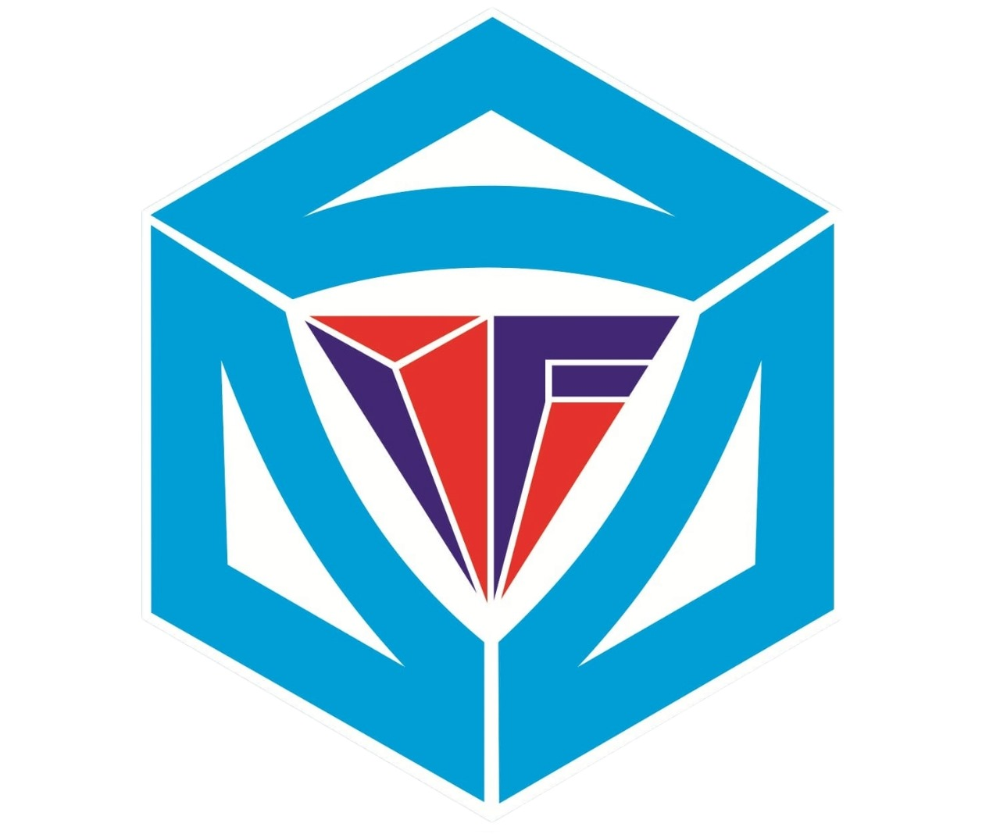

# Himpunan Mahasiswa Informatika (HMIF) - Sekolah Tinggi Teknik (STT) Malang

    

## Tentang Kami

Himpunan Mahasiswa Informatika (HMIF) merupakan organisasi kemahasiswaan di Sekolah Tinggi Teknik (STT) Malang yang bertujuan untuk memfasilitasi mahasiswa dalam mengembangkan pengetahuan dan keterampilan di bidang informatika. HMIF berperan aktif dalam berbagai kegiatan seperti seminar, workshop, pelatihan, lomba, dan pengabdian masyarakat.

## Misi Kami

- Mendorong dan memfasilitasi pengembangan keterampilan teknis mahasiswa dalam bidang informatika.
- Menghubungkan mahasiswa dengan industri teknologi melalui kerjasama dan program magang.
- Membantu mahasiswa dalam mengasah soft skills, seperti kepemimpinan, komunikasi, dan kerjasama tim.
- Menjadi wadah untuk berbagi pengetahuan dan inovasi di kalangan mahasiswa dan alumni.

## Kegiatan Kami

HMIF STT Malang rutin mengadakan berbagai kegiatan yang melibatkan mahasiswa dan profesional di bidang teknologi. Beberapa kegiatan kami antara lain:

- **Seminar & Workshop**: Mengundang praktisi di bidang teknologi untuk berbagi ilmu dan pengalaman.
- **Pelatihan**: Membantu mahasiswa mempelajari keterampilan baru, seperti pemrograman, desain web, pengembangan aplikasi, dan lainnya.
- **Pengabdian Masyarakat**: Mengaplikasikan pengetahuan teknologi untuk membantu masyarakat sekitar melalui berbagai proyek sosial.

## Struktur Kepengurusan

- **Ketua**: Aventus Akong
- **Wakil Ketua**: Alvaro Arvinsya  Jamaliardo Sombuk
- **Sekretaris I**: Nadya Mujahidah Fillah
- **Sekretaris II**: Dinda Erlina Putri
- **Bendahara**: Adinda Fatika Firzaturrohman
- **Koordinator Divisi Humas I**: Fredikardus Lalong Satu
- **Anggota Divisi Humas II**: Mayang Wulan Dahri
- **Koordinator Divisi Ristek I**: Ardiansyah
-  **Anggota Divisi Ristek I**: Adi Chandra Isro’ SalSabilla
-  **Anggota Divisi Ristek I**: Adinda Elvira Salsabiil
- **Koordinator Divisi Desain**: Domisianus Susanto
- **Anggota Divisi Desain**: Weta Silviyana Dewi
- **Koordinator Divisi Medkom**: Haeqel Abdel Fawwazi Reyhan
- **Anggota Divisi Medkom**: Adelia Jasmine Ayu Yuliani
- **Koordinator Divisi Kearsipan**: Adinda Elvira Salsabiil

## Proyek dan Kontribusi

Kami secara aktif mengembangkan beberapa proyek open-source yang dapat diakses oleh publik. Semua mahasiswa dan komunitas luar diundang untuk berkontribusi dan berkolaborasi dalam pengembangan proyek ini. Beberapa proyek yang sedang berjalan:

- **Website HMIF**: Website resmi untuk HMIF STT Malang yang menyediakan informasi terbaru mengenai kegiatan, event, dan pengumuman.

## Cara Bergabung

Kami selalu terbuka bagi mahasiswa baru yang ingin bergabung dan berkontribusi dalam HMIF STT Malang. Jika Anda tertarik untuk bergabung, silakan hubungi kami melalui akun instagram atau datang langsung ke sekretariat HMIF di kampus.

- **Instagram**: @hmifsttmlg
- **Alamat**: Jl. Candi Panggung Barat No. 48, Mojolangu, Kec. Lowokwaru, Kota Malang, Jawa Timur, 65142.

---

Terima kasih atas minat Anda terhadap HMIF STT Malang. Mari bersama-sama memajukan teknologi dan komunitas!

